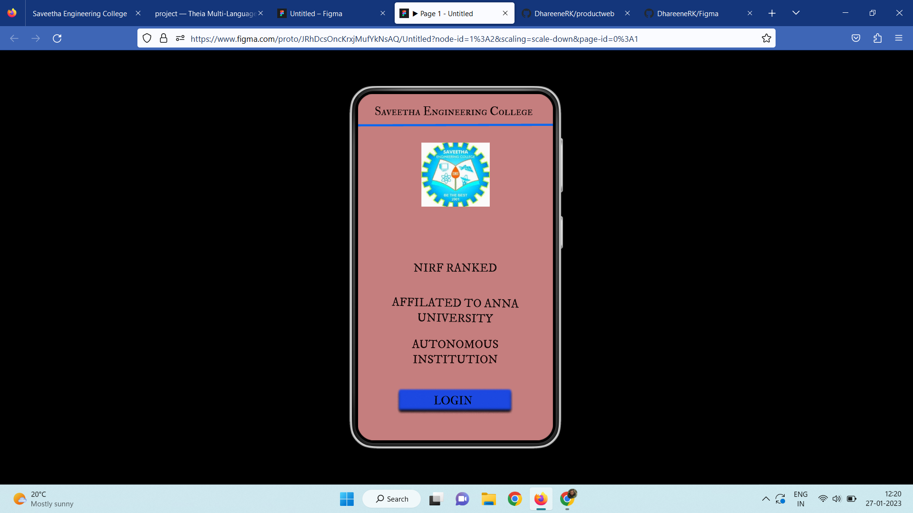
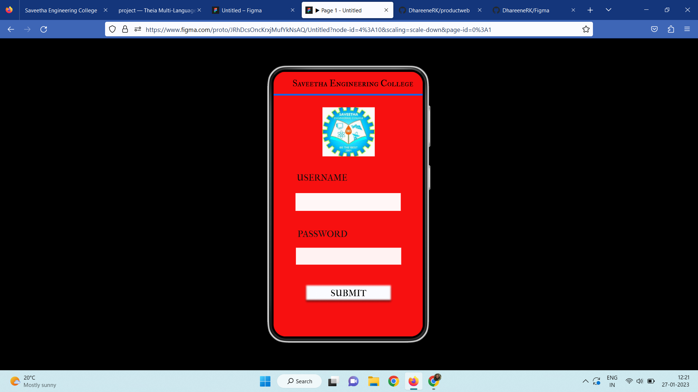
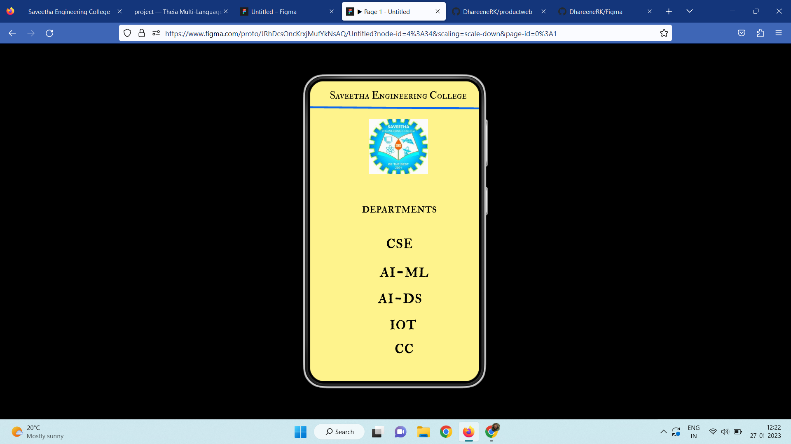

# Event Registration Web Application

## AIM:
To design, develop and deploy a web application for event registration.

## DESIGN STEPS:

### Step 1:
Create a new frame.

### Step 2:
Select any one preset size of your choice.

### Step 3:
Select the shapes you need.

### Step 4:
Import images as needed.

### Step 5:
Create pages based on your need and link them.

### Step 6:

Validate the HTML and CSS code.

### Step 6:

Publish the website in the given URL.

## DESIGN TOOL:
Figma

## code:
```
/* Home Page */
position: relative;
width: 360px;
height: 640px;
background: #C57E7E;
/* Android Small - 1 */
position: relative;
width: 360px;
height: 640px;
background: #F71010;
box-shadow: 0px 4px 4px rgba(0, 0, 0, 0.25), 0px 4px 4px rgba(0, 0, 0, 0.25), 0px 4px 4px rgba(0, 0, 0, 0.25), 0px 4px 4px rgba(0, 0, 0, 0.25), 0px 4px 4px rgba(0, 0, 0, 0.25);
/* Saveetha Engineering College */
position: absolute;
width: 315px;
height: 33px;
left: 30px;
top: 16px;
font-family: 'IM FELL Double Pica SC';
font-style: normal;
font-weight: 400;
font-size: 22px;
line-height: 28px;
text-align: center;
color: #030303;
/* Line 4 */
position: absolute;
width: 361.42px;
height: 6.36px;
left: -0.82px;
top: 49px;
border: 4px solid #0E68EE;
transform: matrix(1, 0.02, -0.02, 1, 0, 0);
/* WhatsApp Image 2023-01-27 at 10.56 6 */
position: absolute;
width: 126px;
height: 118px;
left: 125px;
top: 80px;
background: url(WhatsApp Image 2023-01-27 at 10.56.jpg);
/* departments */
position: absolute;
width: 218px;
height: 45px;
left: 81px;
top: 252px;
font-family: 'IM FELL Double Pica SC';
font-style: normal;
font-weight: 400;
font-size: 30px;
line-height: 38px;
text-align: center;
color: #000000;
/* departments */
position: absolute;
width: 218px;
height: 45px;
left: 81px;
top: 252px;
font-family: 'IM FELL Double Pica SC';
font-style: normal;
font-weight: 400;
font-size: 30px;
line-height: 38px;
text-align: center;
color: #000000;
/* departments */
position: absolute;
width: 218px;
height: 45px;
left: 81px;
top: 252px;
font-family: 'IM FELL Double Pica SC';
font-style: normal;
font-weight: 400;
font-size: 30px;
line-height: 38px;
text-align: center;
color: #000000;
/* cse */
position: absolute;
width: 160px;
height: 61px;
left: 110px;
top: 314px;
font-family: 'IM FELL Double Pica SC';
font-style: normal;
font-weight: 400;
font-size: 45px;
line-height: 56px;
text-align: center;
color: #000000;
/* cse */
position: absolute;
width: 160px;
height: 61px;
left: 110px;
top: 314px;
font-family: 'IM FELL Double Pica SC';
font-style: normal;
font-weight: 400;
font-size: 45px;
line-height: 56px;
text-align: center;
color: #000000;
/* cse */
position: absolute;
width: 160px;
height: 61px;
left: 110px;
top: 314px;
font-family: 'IM FELL Double Pica SC';
font-style: normal;
font-weight: 400;
font-size: 45px;
line-height: 56px;
text-align: center;
color: #000000;
/* cse */
position: absolute;
width: 160px;
height: 61px;
left: 110px;
top: 314px;
font-family: 'IM FELL Double Pica SC';
font-style: normal;
font-weight: 400;
font-size: 45px;
line-height: 56px;
text-align: center;
color: #000000;
/* ai-ml */
position: absolute;
width: 115px;
height: 56px;
left: 143px;
top: 375px;
font-family: 'IM FELL Double Pica SC';
font-style: normal;
font-weight: 400;
font-size: 45px;
line-height: 56px;
text-align: center;
color: #000000;
/* ai-ds */
position: absolute;
width: 121px;
height: 56px;
left: 131px;
top: 431px;
font-family: 'IM FELL Double Pica SC';
font-style: normal;
font-weight: 400;
font-size: 45px;
line-height: 56px;
text-align: center;
color: #000000;
/* iot */
position: absolute;
width: 87px;
height: 61px;
left: 154px;
top: 487px;
font-family: 'IM FELL Double Pica SC';
font-style: normal;
font-weight: 400;
font-size: 45px;
line-height: 56px;
text-align: center;
color: #000000;
/* cc */
position: absolute;
width: 116px;
height: 54px;
left: 142px;
top: 538px;
font-family: 'IM FELL Double Pica SC';
font-style: normal;
font-weight: 400;
font-size: 45px;
line-height: 56px;
text-align: center;
color: #000000;
```
## OUTPUT:




## RESULT:
The program to design, develop and deploy a web application for event registration is completed successfully.